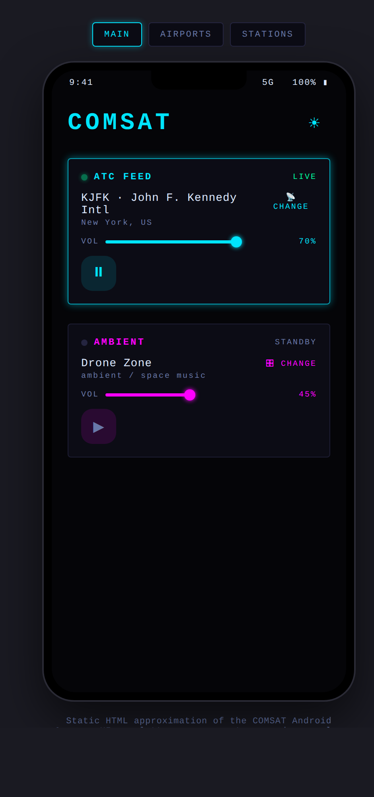
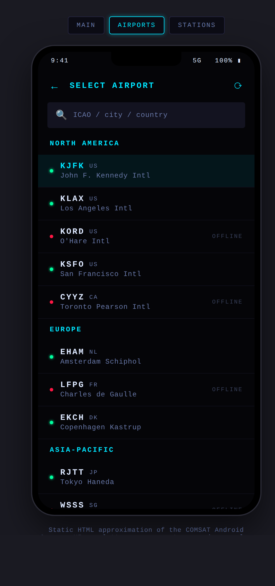
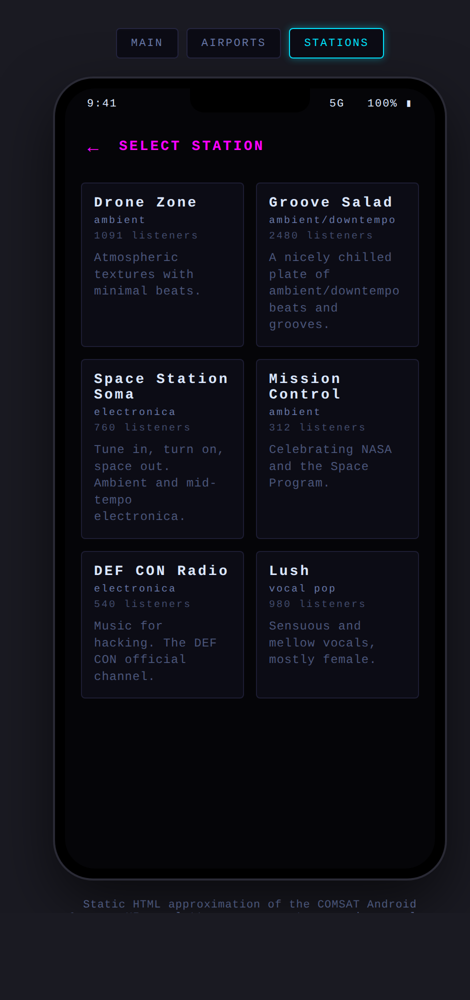

<div align="center">

[English](README.md) · [Русский](README.ru.md)

<h1>COMSAT</h1>

<p><strong>Воздушный трафик сверху. Атмосфера снизу.</strong><br>
Android-аудиопанель, которая смешивает прямой эфир УВД с эмбиент-радио —
два потока, два фейдера, один интерфейс в духе авиационной кабины.</p>

<p><a href="https://github.com/tigrohvost/comsat/actions/workflows/android-ci.yml"></a>   </p>

<p><a href="https://github.com/tigrohvost/comsat/releases/latest/download/COMSAT.apk"><strong>Скачать последний подписанный APK</strong></a></p>



<sub>Концепт интерфейса. Интерфейс приложения реализован нативно на Jetpack Compose.</sub>

</div>

## Два канала, одна атмосфера

| `COMM 1 · ATC` | `COMM 2 · AMBIENT` | `PANEL` |
|---|---|---|
| Эфиры LiveATC по аэропортам, проверка доступности и погода METAR/ATIS | Каталог SomaFM и генерируемые эмбиент-треки Rain Radio | Независимая громкость, FFT-спектры в реальном времени, темы и сохранение выбранных станций |

Воспроизведение продолжается в фоне через foreground media service. Управление
с экрана блокировки и гарнитуры направляет оба экземпляра ExoPlayer через одну
MediaSession; встроены переподключение с задержкой, управление аудиофокусом,
приглушение звука и защита при отключении наушников.

## В эфир

1. Скачайте [`COMSAT.apk`](https://github.com/tigrohvost/comsat/releases/latest/download/COMSAT.apk).
2. Установите его на Android 8.0 или новее и разрешите уведомления для фонового управления.
3. Выберите аэропорт, эмбиент-станцию и настройте баланс двумя фейдерами.

> [!TIP]
> В наушниках микс звучит объёмнее — и неожиданный эфир диспетчерской не
> заполнит всю комнату. При отключении наушников COMSAT автоматически ставит
> воспроизведение на паузу.

<details>
<summary><strong>Выбор аэропорта и станции</strong></summary>

| Аэропорты | Станции |
|---|---|
|  |  |

</details>

## Под панелью

`Kotlin` · `Jetpack Compose / Material 3` · `Media3 / ExoPlayer` · `Hilt` ·
`Retrofit / OkHttp` · `DataStore` · `Coil`

Спектрограмма получает декодированный PCM через `TeeAudioProcessor`, поэтому
разрешение на микрофон не требуется. Release-сборки минифицируются, а
неиспользуемые ресурсы удаляются; GitHub Actions тестирует, проверяет lint,
подписывает и верифицирует каждый APK по тегу, после чего публикует его вместе
с контрольной суммой SHA-256.

<details>
<summary><strong>Сборка из исходников</strong></summary>

Требуются JDK 21, Android SDK 37 и Build Tools 37.0.0.

```bash
./gradlew testDebugUnitTest lintDebug assembleDebug
./gradlew -Pcomsat.testBuildType=release testReleaseUnitTest lintRelease assembleRelease
```

Для подписанной release-сборки передайте keystore через переменные окружения:

```bash
export COMSAT_KEYSTORE=/absolute/path/to/comsat-release.keystore
export COMSAT_KEYSTORE_PASSWORD='<store password>'
export COMSAT_KEY_ALIAS=comsat
export COMSAT_KEY_PASSWORD='<key password>'
./gradlew assembleRelease
```

Без переменных подписи Gradle намеренно создаёт неподписанный release APK.
Учётные данные и keystore игнорируются Git и не должны попадать в репозиторий.

</details>

<details>
<summary><strong>Публикация релиза</strong></summary>

Чтобы собрать и проверить подписанный APK без публикации релиза, запустите
**Actions → Android Release → Run workflow** для нужной ветки. Артефакт `COMSAT-…`
содержит подписанный APK, его SHA-256 и `build-info.json` с коммитом исходников.
Workflow также запускает минифицированный APK на Android-эмуляторе без сети и
проверяет выбор источников, остановку воспроизведения, сохранённые настройки,
темы, горизонтальную ориентацию и крупный шрифт. Скриншоты и отчёты тестов
загружаются отдельно. Секреты подписи нужны для обоих режимов.

Задайте секреты репозитория `COMSAT_KEYSTORE_BASE64` и
`COMSAT_KEYSTORE_PASSWORD`, обновите `versionName` / `versionCode`, затем
отправьте соответствующий семантический тег:

```bash
git tag -a v1.3.3 -m "COMSAT 1.3.3"
git push origin v1.3.3
```

Release workflow отклоняет тег, который не совпадает с версией приложения.
Успешный запуск публикует стабильные assets `COMSAT.apk` и
`COMSAT.apk.sha256`, поэтому ссылка вверху всегда ведёт на последний релиз.

Для такой же проверки локально настройте подпись, запустите отдельный тестовый
эмулятор и выполните `bash tools/run_release_smoke.sh`. Скрипт отключает Wi-Fi и
мобильную сеть эмулятора. Обычный CI также тестирует и собирает неподписанный
release-вариант для каждого pull request и push в `main`.

</details>

## Источники сигнала

Эфиры УВД поступают из [LiveATC](https://www.liveatc.net/), эмбиент-станции —
из поддерживаемого слушателями [SomaFM](https://somafm.com/) и Rain Radio.
COMSAT не связан с LiveATC или SomaFM. Потоки зависят от сторонней и
волонтёрской инфраструктуры, поэтому отдельные станции могут исчезать или
временно прекращать вещание.

Проект вдохновлён [listen to the.cloud](https://listentothe.cloud/) —
оригинальным браузерным миксом эфира УВД и эмбиента.
